# 计算机软件操作手册

---

## 软件名称：企业资产与物资管理系统 V1.0

---

### 著作权人：[请填写]

### 版本号：V1.0

### 编写日期：2026年05月

---

## 目 录

1 引言
　1.1 编写目的
　1.2 项目背景
　1.3 术语与缩略语
　1.4 参考资料

2 软件概述
　2.1 软件用途
　2.2 软件功能
　2.3 软件特点

3 运行环境
　3.1 硬件环境
　3.2 软件环境
　3.3 网络环境

4 软件安装与部署
　4.1 服务端部署
　4.2 前端部署
　4.3 微信小程序部署
　4.4 数据库初始化

5 软件操作说明
　5.1 系统登录
　5.2 系统首页
　5.3 系统管理
　　5.3.1 用户管理
　　5.3.2 部门管理
　　5.3.3 岗位管理
　　5.3.4 角色管理
　　5.3.5 菜单管理
　　5.3.6 字典管理
　　5.3.7 参数设置
　　5.3.8 通知公告
　5.4 仓库管理
　　5.4.1 仓库信息管理
　5.5 物资入库管理
　　5.5.1 入库单列表
　　5.5.2 新增入库单
　　5.5.3 入库单详情
　5.6 物资管理
　　5.6.1 物资分类管理
　　5.6.2 物资信息管理
　5.7 资产管理
　　5.7.1 资产流转记录
　　5.7.2 资产变更记录
　5.8 巡检管理
　　5.8.1 巡检项目管理
　　5.8.2 巡检记录管理
　5.9 报修管理
　　5.9.1 报修记录管理
　5.10 使用说明书管理
　5.11 系统监控
　　5.11.1 操作日志
　　5.11.2 登录日志
　　5.11.3 在线用户
　　5.11.4 定时任务
　　5.11.5 服务监控
　　5.11.6 缓存监控
　　5.11.7 数据监控
　5.12 系统工具
　　5.12.1 代码生成
　　5.12.2 系统接口
　5.13 微信小程序端
　　5.13.1 小程序登录
　　5.13.2 首页功能
　　5.13.3 资产详情查看
　　5.13.4 巡检报告
　　5.13.5 报修申请
　　5.13.6 报修处理
　　5.13.7 个人中心

6 异常处理与常见问题
　6.1 登录异常
　6.2 数据操作异常
　6.3 网络异常
　6.4 文件上传异常

7 附录
　7.1 数据字典说明
　7.2 系统权限说明
　7.3 快捷操作说明

---

## 1 引言

### 1.1 编写目的

本手册旨在为"企业资产与物资管理系统"的使用者提供详细的操作指导，帮助用户快速掌握系统的各项功能，确保系统能够被正确、高效地使用。本手册适用于系统管理员、仓库管理员、巡检人员、维修人员及其他业务操作人员。

### 1.2 项目背景

随着企业规模的不断扩大，资产与物资的管理日趋复杂，传统的人工管理方式已难以满足现代化管理需求。为提高企业资产与物资管理的效率和准确性，降低管理成本，特开发本系统。本系统基于成熟的若依（RuoYi）快速开发框架构建，采用前后端分离架构，实现了资产全生命周期管理，涵盖物资入库、出库、巡检、报修、报废等全流程管理。

### 1.3 术语与缩略语

| 术语/缩略语 | 说明 |
|:---|:---|
| ERP | 企业资源计划（Enterprise Resource Planning） |
| JWT | JSON Web Token，用于身份认证的令牌机制 |
| API | 应用程序编程接口（Application Programming Interface） |
| CRUD | 增删改查（Create、Read、Update、Delete） |
| ORM | 对象关系映射（Object Relational Mapping） |
| RESTful | 一种API设计风格 |

### 1.4 参考资料

- 若依官方文档：http://doc.ruoyi.vip
- Spring Boot官方文档
- Vue.js官方文档
- Element UI组件库文档

---

## 2 软件概述

### 2.1 软件用途

本系统是一套面向企业的资产与物资综合管理平台，主要用于：

1. 对企业仓库及物资进行信息化管理，实现物资从采购入库到报废出库的全生命周期跟踪。
2. 管理资产流转记录，确保资产去向清晰、责任明确。
3. 制定并执行设备巡检计划，及时发现设备异常，保障设备正常运行。
4. 提供便捷的报修申请与处理通道，缩短维修响应时间。
5. 管理设备使用说明书等技术文档，方便相关人员查阅。
6. 通过微信小程序实现移动端的巡检、报修等操作，提高现场工作效率。

### 2.2 软件功能

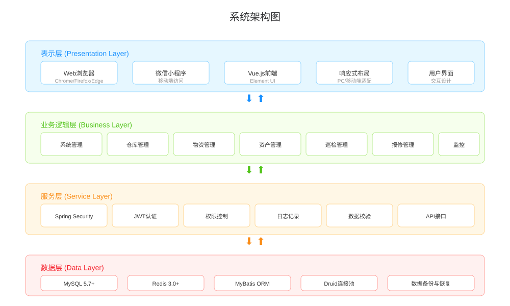

本系统主要包含以下功能模块：

| 序号 | 功能模块 | 功能说明 |
|:---|:---|:---|
| 1 | 系统管理 | 用户管理、部门管理、岗位管理、角色管理、菜单管理、字典管理、参数设置、通知公告 |
| 2 | 仓库管理 | 仓库信息的增删改查，支持仓库编码、地址、联系人等信息维护 |
| 3 | 物资入库 | 入库单管理，支持一单多物资入库，含供应商、发票信息、明细管理及审核流程 |
| 4 | 物资管理 | 物资分类管理、物资信息管理，支持物资编码、规格型号、库存数量、单价、保修期限等信息维护 |
| 5 | 资产管理 | 资产流转记录（入库、出库、报损、报废）、资产变更记录（位置变更、科室变更、状态变更） |
| 6 | 巡检管理 | 巡检项目管理、巡检记录管理，支持按周期制定巡检计划，记录巡检结果及照片 |
| 7 | 报修管理 | 报修记录的提交、处理、完成、驳回、取消等全流程管理 |
| 8 | 使用说明书管理 | 设备使用说明书的上传、关联、版本管理 |
| 9 | 系统监控 | 操作日志、登录日志、在线用户、定时任务、服务监控、缓存监控、数据监控 |
| 10 | 系统工具 | 代码生成、系统接口文档 |
| 11 | 微信小程序 | 移动端登录、资产查看、巡检报告、报修申请与处理、个人中心 |

### 2.3 软件特点

1. **前后端分离架构**：后端采用Spring Boot框架，前端采用Vue.js + Element UI，松耦合设计便于独立开发与部署。
2. **多终端支持**：除Web端外，提供微信小程序端，支持现场扫码巡检、报修等移动办公场景。
3. **权限控制精细**：基于RBAC权限模型，支持菜单权限、按钮权限、数据权限的多级控制。
4. **数据安全可靠**：采用JWT令牌认证、XSS防护、SQL注入防护等安全机制，保障系统数据安全。
5. **操作日志完整**：系统自动记录用户操作日志和登录日志，便于追溯与审计。
6. **代码生成高效**：内置代码生成器，可一键生成前后端CRUD代码，提高开发效率。

---

## 3 运行环境

### 3.1 硬件环境

**服务器端：**

| 项目 | 最低配置 | 推荐配置 |
|:---|:---|:---|
| CPU | 2核 | 4核及以上 |
| 内存 | 4GB | 8GB及以上 |
| 硬盘 | 50GB | 100GB及以上 |
| 网络 | 100Mbps | 1000Mbps |

**客户端：**

| 项目 | 最低配置 |
|:---|:---|
| CPU | 1GHz |
| 内存 | 2GB |
| 显示器 | 分辨率1024×768及以上 |
| 网络 | 10Mbps |

### 3.2 软件环境

**服务端：**

| 类型 | 名称 | 版本 |
|:---|:---|:---|
| 操作系统 | Windows Server / Linux（CentOS/Ubuntu） | 不限 |
| JDK | Java Development Kit | 1.8及以上 |
| 数据库 | MySQL | 5.7及以上 |
| 缓存 | Redis | 3.0及以上 |
| Web服务器 | Apache Tomcat（内嵌） | 9.0 |
| 应用框架 | Spring Boot | 2.5.15 |
| 安全框架 | Spring Security | 5.7.14 |
| ORM框架 | MyBatis | 不限 |
| 连接池 | Druid | 1.2.28 |
| 接口文档 | Swagger | 3.0.0 |

**客户端：**

| 类型 | 名称 | 版本 |
|:---|:---|:---|
| 浏览器 | Chrome / Firefox / Edge / Safari | 最新稳定版 |
| 前端框架 | Vue.js | 2.x |
| UI组件库 | Element UI | 不限 |
| 微信小程序 | 微信开发者工具 | 最新稳定版 |

### 3.3 网络环境

1. 服务器需部署在可访问的网络环境中，确保客户端能够通过HTTP/HTTPS协议访问。
2. 服务器需开放8080端口（Web服务端口）。
3. 数据库服务器（MySQL）需开放3306端口。
4. 缓存服务器（Redis）需开放6379端口。
5. 微信小程序端需确保服务器域名已配置HTTPS证书并在微信公众平台完成域名白名单配置。

---

## 4 软件安装与部署

### 4.1 服务端部署

**步骤一：安装JDK环境**

1. 下载并安装JDK 1.8或以上版本。
2. 配置JAVA_HOME环境变量，将其指向JDK安装目录。
3. 将`%JAVA_HOME%/bin`添加到系统PATH环境变量中。
4. 执行`java -version`命令验证安装是否成功。

**步骤二：安装MySQL数据库**

1. 下载并安装MySQL 5.7或以上版本。
2. 创建数据库，执行`sql/`目录下的初始化脚本完成数据库表的创建和初始数据的导入。
3. 修改`ruoyi-admin/src/main/resources/application-druid.yml`中的数据库连接信息，包括数据库地址、端口、用户名和密码。

**步骤三：安装Redis缓存**

1. 下载并安装Redis 3.0或以上版本。
2. 启动Redis服务。
3. 如需配置密码，修改`ruoyi-admin/src/main/resources/application.yml`中的Redis连接配置。

**步骤四：启动后端服务**

1. 使用Maven构建项目：在项目根目录执行`mvn clean package`命令。
2. 运行打包后的jar文件：`java -jar ruoyi-admin.jar`。
3. 或使用开发工具（如IntelliJ IDEA）直接运行`RuoYiApplication`主类启动服务。
4. 服务启动成功后，默认监听8080端口。

### 4.2 前端部署

**步骤一：安装Node.js环境**

1. 下载并安装Node.js（建议版本12.x或以上）。
2. 执行`node -v`和`npm -v`命令验证安装是否成功。

**步骤二：安装前端依赖**

1. 进入`ruoyi-ui`目录。
2. 执行`npm install`命令安装项目依赖。

**步骤三：配置后端接口地址**

1. 修改`ruoyi-ui`目录下的接口配置文件，将后端API地址指向实际的服务端地址。

**步骤四：启动前端服务**

1. 执行`npm run dev`命令启动前端开发服务器。
2. 启动成功后，通过浏览器访问`http://localhost`即可打开系统登录页面。

**步骤五：生产环境部署**

1. 执行`npm run build`命令构建生产环境前端资源。
2. 将生成的`dist`目录下的文件部署到Nginx或其他Web服务器中。

### 4.3 微信小程序部署

1. 下载并安装微信开发者工具。
2. 使用微信开发者工具打开`mini-program`目录。
3. 在`mini-program/utils/request.js`中配置后端API接口地址。
4. 在微信公众平台完成小程序的注册、审核和发布。

### 4.4 数据库初始化

1. 创建MySQL数据库，字符集设置为`utf8mb4`。
2. 按顺序执行`sql/`目录下的SQL脚本：
   - `ry_20260417.sql`：基础系统表结构和数据
   - `biz_tables.sql`：业务模块表结构
   - `stock_in.sql`：物资入库功能表结构及菜单数据
   - 其他业务SQL脚本：根据业务需要执行对应的增量脚本
3. 验证数据库表是否创建成功。

---

## 5 软件操作说明

### 5.1 系统登录

**操作说明：**

用户通过浏览器访问系统地址，进入系统登录页面。

**操作步骤：**

1. 打开浏览器，在地址栏输入系统访问地址（如：`http://服务器IP:8080`）。
2. 系统显示登录页面，包含用户名输入框、密码输入框和验证码输入框。
3. 在"用户名"输入框中输入分配的用户账号。
4. 在"密码"输入框中输入对应的密码。
5. 在"验证码"输入框中输入页面显示的数学计算验证码结果。
6. 点击"登录"按钮。
7. 系统验证通过后自动跳转至系统首页。

**界面示意：**

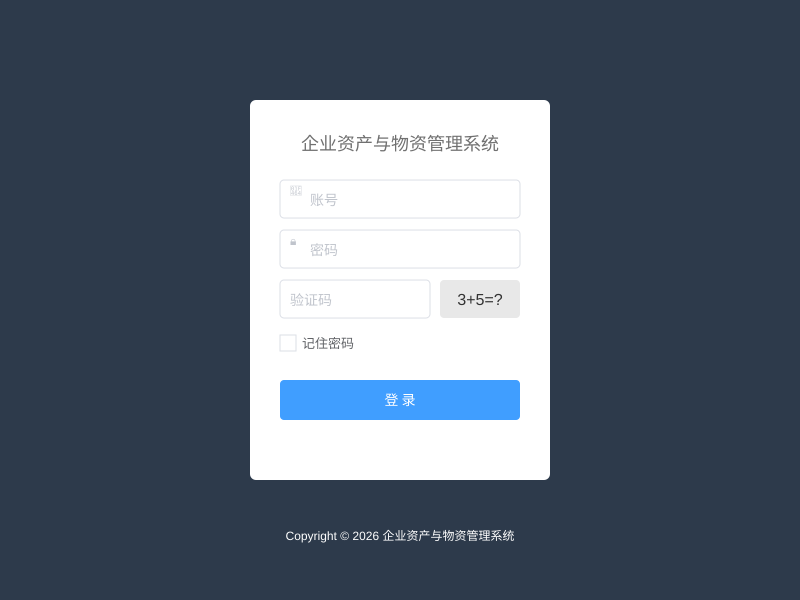

**注意事项：**

- 连续输入错误密码5次，账号将被锁定10分钟。
- 验证码不区分大小写。
- 首次登录建议修改初始密码。

### 5.2 系统首页

**操作说明：**

登录成功后进入系统首页，首页展示系统导航菜单和常用功能入口。

**功能说明：**

- **顶部导航栏**：显示系统名称、全屏切换、布局大小设置、用户头像及下拉菜单（个人中心、系统设置、退出登录）。
- **左侧菜单栏**：以树形结构展示系统所有功能模块菜单，点击菜单项可进入对应功能页面。
- **主内容区**：显示当前操作页面的内容。
- **标签页导航**：已打开的页面以标签页形式展示，方便在多个页面间快速切换。

**界面示意：**

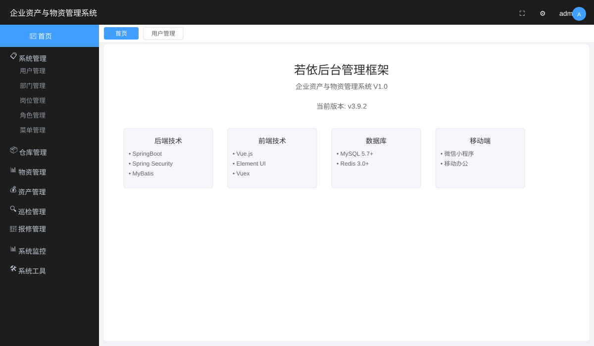

### 5.3 系统管理

#### 5.3.1 用户管理

**功能说明：** 管理系统用户信息，包括新增、修改、删除、重置密码、分配角色等操作。

**操作步骤：**

1. 在左侧菜单中点击"系统管理" -> "用户管理"，进入用户管理页面。
2. 页面以表格形式展示所有用户信息，支持按用户名、手机号、状态等条件进行筛选查询。
3. **新增用户**：点击"新增"按钮，弹出新增用户对话框，填写用户信息（用户名、昵称、部门、手机号、邮箱、密码等），选择角色和岗位，点击"确定"保存。
4. **修改用户**：在用户列表中点击目标用户所在行的"修改"按钮，弹出修改对话框，修改相应信息后点击"确定"保存。
5. **删除用户**：勾选目标用户，点击"删除"按钮，确认后删除。
6. **重置密码**：点击目标用户所在行的"重置密码"按钮，可将该用户密码重置为默认密码。
7. **导出数据**：点击"导出"按钮，可将当前查询结果导出为Excel文件。

**界面示意：**

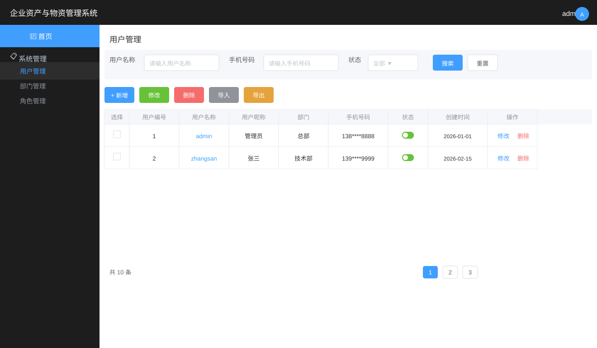

#### 5.3.2 部门管理

**功能说明：** 配置系统组织机构（公司、部门、小组），以树形结构展现，支持数据权限控制。

**操作步骤：**

1. 在左侧菜单中点击"系统管理" -> "部门管理"，进入部门管理页面。
2. 左侧显示部门树形结构，右侧显示部门详细信息列表。
3. **新增部门**：点击"新增"按钮，填写部门名称、排序、负责人、联系电话、邮箱、状态等信息，选择上级部门，点击"确定"保存。
4. **修改部门**：点击目标部门所在行的"修改"按钮，修改信息后保存。
5. **删除部门**：点击目标部门所在行的"删除"按钮，确认后删除。删除部门前需确保该部门下无子部门和用户。

#### 5.3.3 岗位管理

**功能说明：** 配置系统用户所属担任职务。

**操作步骤：**

1. 在左侧菜单中点击"系统管理" -> "岗位管理"，进入岗位管理页面。
2. **新增岗位**：点击"新增"按钮，填写岗位编码、岗位名称、排序、状态等信息，点击"确定"保存。
3. **修改/删除岗位**：在列表中选择目标岗位进行修改或删除操作。

#### 5.3.4 角色管理

**功能说明：** 管理系统角色，配置角色的菜单权限和数据权限。

**操作步骤：**

1. 在左侧菜单中点击"系统管理" -> "角色管理"，进入角色管理页面。
2. **新增角色**：点击"新增"按钮，填写角色名称、权限字符、排序等信息，选择菜单权限和数据权限范围，点击"确定"保存。
3. **修改角色**：点击目标角色所在行的"修改"按钮，可修改角色信息和权限配置。
4. **数据权限**：支持全部数据权限、自定义数据权限、本部门数据权限、本部门及以下数据权限、仅本人数据权限等多种数据范围控制。

#### 5.3.5 菜单管理

**功能说明：** 配置系统菜单、操作权限和按钮权限标识。

**操作步骤：**

1. 在左侧菜单中点击"系统管理" -> "菜单管理"，进入菜单管理页面。
2. 菜单以树形表格展示，支持目录、菜单和按钮三种类型。
3. **新增菜单**：点击"新增"按钮，选择菜单类型（目录/菜单/按钮），填写菜单名称、排序、路由地址、组件路径等信息，设置权限标识，点击"确定"保存。
4. **修改/删除菜单**：在列表中选择目标菜单进行修改或删除操作。

#### 5.3.6 字典管理

**功能说明：** 对系统中经常使用的一些较为固定的数据进行维护，如状态、类型等枚举值。

**操作步骤：**

1. 在左侧菜单中点击"系统管理" -> "字典管理"，进入字典管理页面。
2. **新增字典**：点击"新增"按钮，填写字典名称、字典类型、状态等信息，点击"确定"保存。
3. **字典数据管理**：点击目标字典所在行的"字典数据"按钮，可管理该字典下的具体数据项。

#### 5.3.7 参数设置

**功能说明：** 对系统动态配置常用参数。

**操作步骤：**

1. 在左侧菜单中点击"系统管理" -> "参数设置"，进入参数设置页面。
2. 支持新增、修改、删除、刷新缓存等操作。
3. 系统内置参数包括：账号初始密码、用户登录验证码开关、注册用户开关等。

#### 5.3.8 通知公告

**功能说明：** 系统通知公告信息的发布与维护。

**操作步骤：**

1. 在左侧菜单中点击"系统管理" -> "通知公告"，进入通知公告页面。
2. **新增公告**：点击"新增"按钮，填写公告标题、类型（通知/公告）、内容等信息，点击"确定"发布。
3. **修改/删除公告**：在列表中选择目标公告进行修改或删除操作。

### 5.4 仓库管理

#### 5.4.1 仓库信息管理

**功能说明：** 管理企业仓库的基本信息，包括仓库编码、名称、地址、联系人等。

**操作步骤：**

1. 在左侧菜单中点击"仓库管理" -> "仓库信息管理"，进入仓库信息管理页面。
2. 页面以表格形式展示所有仓库信息，支持按仓库编码、仓库名称、状态等条件进行筛选查询。
3. **新增仓库**：点击"新增"按钮，弹出新增仓库对话框。
   - 仓库编码：输入唯一的仓库编码（必填，不超过64个字符）。
   - 仓库名称：输入仓库名称（必填，不超过100个字符）。
   - 仓库地址：输入仓库所在地址。
   - 联系人：输入仓库负责人姓名。
   - 联系电话：输入联系人电话号码。
   - 状态：选择"正常"或"停用"。
   - 点击"确定"保存。
4. **修改仓库**：点击目标仓库所在行的"修改"按钮，修改信息后保存。
5. **删除仓库**：勾选目标仓库，点击"删除"按钮，确认后删除。
6. **导出数据**：点击"导出"按钮，可将仓库信息导出为Excel文件。

**界面示意：**

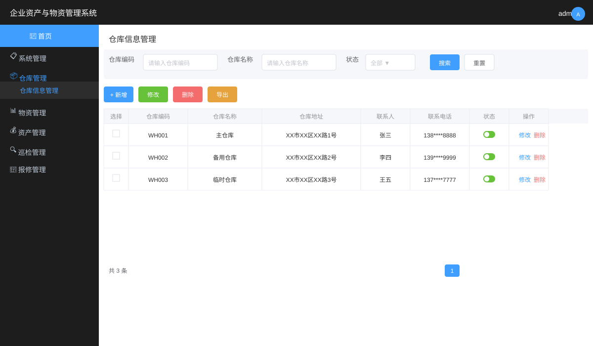

### 5.5 物资入库管理

#### 5.5.1 入库单列表

**功能说明：** 管理物资入库单，支持一单多物资入库，共享供应商和发票信息，实现入库全流程管理。

**操作步骤：**

1. 在左侧菜单中点击"仓库管理" -> "物资入库"，进入入库单列表页面。
2. 页面以表格形式展示所有入库单，支持按入库单号、供应商、入库仓库、状态、入库日期等条件筛选查询。
3. 列表展示入库单号、供应商、入库仓库、入库数量、入库金额、入库日期、状态等信息。
4. 状态说明：待审核（蓝色标签）、已审核（绿色标签）、已驳回（红色标签）。
5. **操作按钮：**
   - 详情：查看入库单完整信息及入库明细。
   - 修改：对待审核状态的入库单进行修改。
   - 审核：对待审核状态的入库单进行审核（通过或驳回）。
   - 删除：对待审核状态的入库单进行删除。
6. **导出数据：** 点击"导出"按钮，可将入库单信息导出为Excel文件。

**界面示意：**

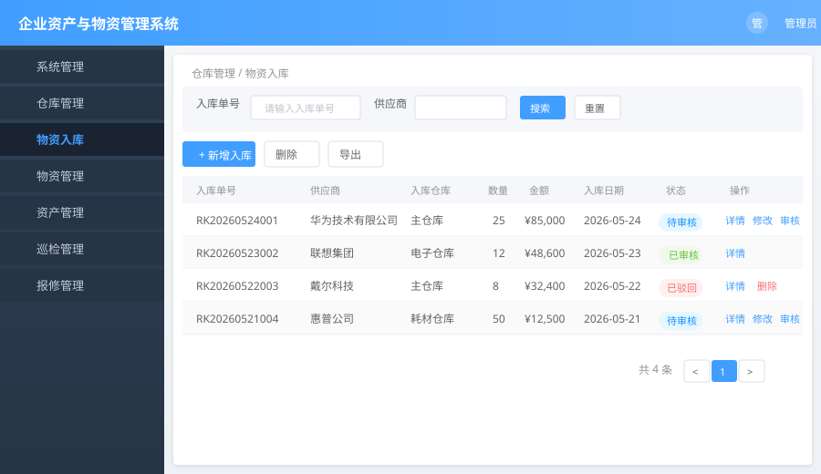

#### 5.5.2 新增入库单

**操作步骤：**

1. 在入库单列表页面点击"新增入库"按钮，弹出新增入库单对话框。
2. **填写主表信息：**
   - 入库单号：系统自动生成，无需手动输入。
   - 供应商：输入供应商名称（必填）。
   - 入库仓库：从下拉列表中选择入库目标仓库（必填）。
   - 入库日期：选择入库日期（必填）。
   - 发票号：输入关联的发票编号。
   - 发票金额：输入发票金额。
   - 备注：填写备注信息。
3. **添加入库明细：**
   - 点击"添加物资"按钮，新增一行明细记录。
   - 物资：从下拉列表中选择已有物资，选择后自动填充规格型号、单位、单价、保修期限等信息。
   - 数量：输入入库数量。
   - 单价：可修改默认单价。
   - 批次号：输入物资批次号。
   - 保修期限：可修改默认保修期限（天）。
   - 支持添加多条明细记录，也可删除已有明细。
4. 系统自动计算入库总数量和总金额。
5. 点击"确定"保存入库单。

**界面示意：**

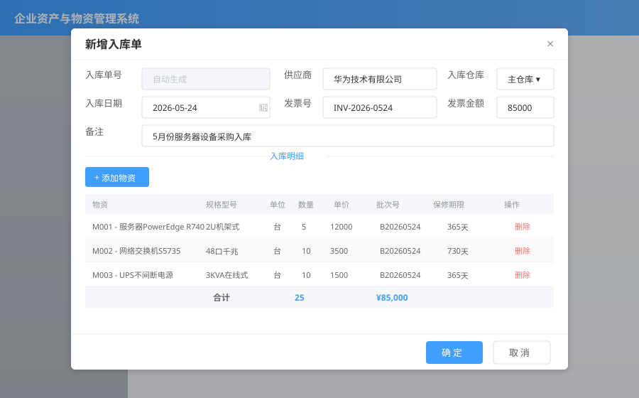

#### 5.5.3 入库单详情

**操作步骤：**

1. 在入库单列表页面点击目标入库单所在行的"详情"按钮，弹出详情对话框。
2. 上半部分展示入库单主表信息：入库单号、供应商、入库仓库、入库日期、发票信息、总数量、总金额、状态、备注。
3. 下半部分展示入库明细表格：物资编码、物资名称、规格型号、单位、数量、单价、金额、批次号、保修期限。

**界面示意：**

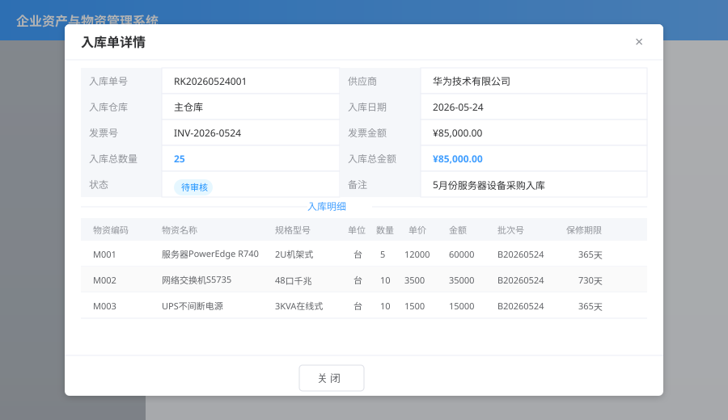

**入库单审核流程：**

1. 新增的入库单默认为"待审核"状态。
2. 具有审核权限的用户可点击"审核"按钮，选择"通过"或"驳回"，并填写审核备注。
3. 审核通过后，入库单状态变为"已审核"，已审核的入库单不允许修改和删除。
4. 驳回后，入库单状态变为"已驳回"，可修改后重新提交。

### 5.6 物资管理

#### 5.6.1 物资分类管理

**功能说明：** 管理物资的分类信息，支持多级分类。

**操作步骤：**

1. 在左侧菜单中点击"物资管理" -> "物资分类管理"，进入物资分类管理页面。
2. 分类以树形表格展示，支持新增、修改、删除操作。
3. **新增分类**：点击"新增"按钮，填写分类名称、排序、状态等信息，选择上级分类，点击"确定"保存。

#### 5.6.2 物资信息管理

**功能说明：** 管理企业物资的详细信息，包括物资编码、名称、分类、规格型号、库存数量、单价、保修期限、供应商等。

**操作步骤：**

1. 在左侧菜单中点击"物资管理" -> "物资信息管理"，进入物资信息管理页面。
2. 页面以表格形式展示所有物资信息，支持按物资编码、物资名称、分类等条件进行筛选查询。
3. **新增物资**：点击"新增"按钮，弹出新增物资对话框。
   - 物资编码：输入唯一的物资编码（必填）。
   - 资产编码：输入二维码内容，用于扫码识别。
   - 物资名称：输入物资名称（必填）。
   - 物资分类：从下拉列表中选择物资所属分类。
   - 规格型号：输入物资的规格型号。
   - 计量单位：输入物资的计量单位（如：个、台、套）。
   - 库存数量：输入当前库存数量。
   - 使用科室：输入物资使用的科室。
   - 位置：输入物资存放位置。
   - 管理科室：输入物资的管理部门。
   - 单价：输入物资单价。
   - 保修期限：输入保修期限，单位为天。
   - 供应商：输入供应商名称。
   - 所在仓库：从下拉列表中选择物资所在仓库。
   - 状态：选择"正常"或"停用"。
   - 点击"确定"保存。
4. **修改物资**：点击目标物资所在行的"修改"按钮，修改信息后保存。
5. **删除物资**：勾选目标物资，点击"删除"按钮，确认后删除。
6. **导出数据**：点击"导出"按钮，可将物资信息导出为Excel文件。

**界面示意：**

```
┌──────────────────────────────────────────────────────────────┐
│  物资信息管理                                                 │
├──────────────────────────────────────────────────────────────┤
│  物资编码：[        ] 物资名称：[        ] 分类：[全部▼]      │
│  [搜索] [重置]                                               │
├──────────────────────────────────────────────────────────────┤
│  [新增] [修改] [删除] [导出]                                   │
├────┬────────┬────────┬──────┬──────┬──────┬──────┬───────────┤
│ 选择│物资编码 │物资名称 │ 分类 │规格型号│库存数量│ 单价 │   操作    │
├────┼────────┼────────┼──────┼──────┼──────┼──────┼───────────┤
│ □  │ M001   │ 服务器A │ 电子 │R740  │  5   │12000 │ 修改 删除  │
│ □  │ M002   │ 打印机B │ 外设 │HP110 │  10  │ 2500 │ 修改 删除  │
└────┴────────┴────────┴──────┴──────┴──────┴──────┴───────────┘
```

### 5.7 资产管理

#### 5.7.1 资产流转记录

**功能说明：** 记录物资的入库、出库、报损、报废等流转操作，实现资产去向的全程跟踪。

**操作步骤：**

1. 在左侧菜单中点击"资产管理" -> "资产流转记录"，进入资产流转记录页面。
2. 页面以表格形式展示所有流转记录，支持按物资编码、物资名称、流转类型、操作时间等条件筛选查询。
3. **新增流转记录**：点击"新增"按钮，弹出新增对话框。
   - 物资：从下拉列表中选择关联物资。
   - 资产编码：自动填入选中物资的资产编码。
   - 流转类型：选择"入库"、"出库"、"报损"或"报废"。
   - 数量：输入流转数量。
   - 操作人：输入操作人员姓名。
   - 操作时间：选择操作时间。
   - 来源仓库：选择物资来源仓库（入库时可不填）。
   - 目标仓库：选择物资目标仓库（出库时可不填）。
   - 领用人/接收人：输入领用或接收人员姓名。
   - 原因/用途：输入流转原因或用途说明。
   - 点击"确定"保存。
4. **修改记录**：点击目标记录所在行的"修改"按钮进行修改。
5. **删除记录**：勾选目标记录，点击"删除"按钮进行删除。
6. **导出数据**：点击"导出"按钮导出为Excel文件。

#### 5.7.2 资产变更记录

**功能说明：** 记录资产的位置变更、科室变更、状态变更等信息。

**操作步骤：**

1. 在左侧菜单中点击"资产管理" -> "资产变更记录"，进入资产变更记录页面。
2. 页面以表格形式展示所有变更记录。
3. **新增变更记录**：点击"新增"按钮，弹出新增对话框。
   - 物资：从下拉列表中选择关联物资。
   - 变更类型：选择"位置变更"、"科室变更"、"状态变更"或"其他"。
   - 变更内容：输入变更描述信息。
   - 变更前值：输入变更前的值。
   - 变更后值：输入变更后的值。
   - 操作人：输入操作人员姓名。
   - 变更时间：选择变更发生时间。
   - 点击"确定"保存。
4. 支持修改、删除和导出操作。

### 5.8 巡检管理

#### 5.8.1 巡检项目管理

**功能说明：** 管理巡检检查项目，定义巡检需要检查的具体内容。

**操作步骤：**

1. 在左侧菜单中点击"巡检管理" -> "巡检项目管理"，进入巡检项目管理页面。
2. 支持新增、修改、删除巡检项目。
3. **新增巡检项目**：点击"新增"按钮，填写项目名称、检查内容、检查标准等信息，点击"确定"保存。

#### 5.8.2 巡检记录管理

**功能说明：** 记录设备巡检的执行情况，包括巡检人、巡检时间、巡检结果、巡检照片等。

**操作步骤：**

1. 在左侧菜单中点击"巡检管理" -> "巡检记录管理"，进入巡检记录管理页面。
2. 页面以表格形式展示所有巡检记录，支持按巡检人、巡检结果、巡检周期等条件筛选查询。
3. **新增巡检记录**：点击"新增"按钮，弹出新增对话框。
   - 物资：从下拉列表中选择巡检的设备/物资。
   - 巡检人：输入巡检人员姓名。
   - 巡检时间：选择巡检执行时间。
   - 巡检结果：选择"正常"或"异常"。
   - 巡检周期：选择"每日"、"每周"、"每月"、"每季度"或"每年"。
   - 巡检项目：勾选本次巡检包含的检查项。
   - 巡检照片：上传巡检现场照片（支持多张）。
   - 巡检明细：对每个检查项填写具体检查结果。
   - 点击"确定"保存。
4. **查看巡检详情**：点击目标记录所在行的"详情"按钮，可查看巡检的完整信息。
5. 支持修改、删除和导出操作。

**界面示意：**

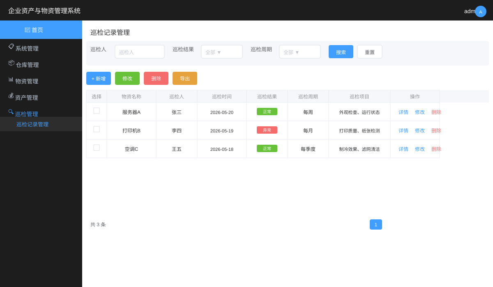

### 5.9 报修管理

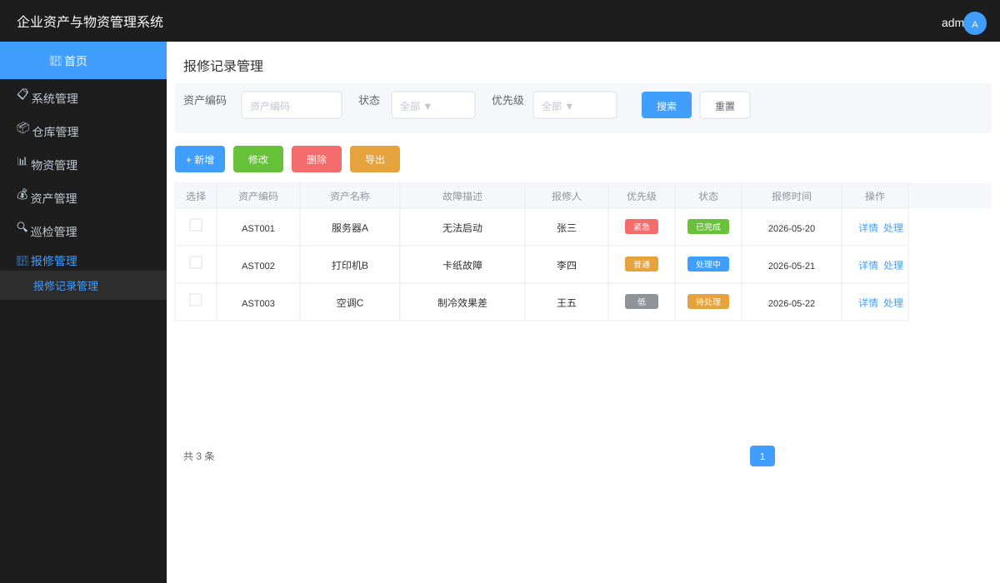

#### 5.9.1 报修记录管理

**功能说明：** 管理设备报修的全流程，包括报修提交、处理指派、维修记录、完成确认等环节。

**操作步骤：**

1. 在左侧菜单中点击"报修管理" -> "报修记录管理"，进入报修记录管理页面。
2. 页面以表格形式展示所有报修记录，支持按资产编码、资产名称、状态、优先级等条件筛选查询。
3. **新增报修**：点击"新增"按钮，弹出新增报修对话框。
   - 资产编码：输入或扫码录入故障设备的资产编码。
   - 资产名称：输入故障设备名称（必填）。
   - 故障描述：详细描述设备故障现象（必填）。
   - 故障时间：选择故障发生时间（必填）。
   - 报修人：输入报修人员姓名（必填）。
   - 联系电话：输入报修人联系电话。
   - 故障位置：输入故障设备所在位置。
   - 优先级：选择"低"、"普通"、"高"或"紧急"。
   - 故障照片：上传故障现场照片。
   - 点击"确定"提交报修。
4. **处理报修**：点击目标报修记录所在行的"处理"按钮。
   - 处理人：输入维修处理人员姓名。
   - 处理结果：填写维修处理结果。
   - 点击"确定"保存处理信息。
5. **修改/删除报修**：对未完成的报修记录可进行修改或删除操作。
6. **导出数据**：点击"导出"按钮导出为Excel文件。

**报修状态流转说明：**

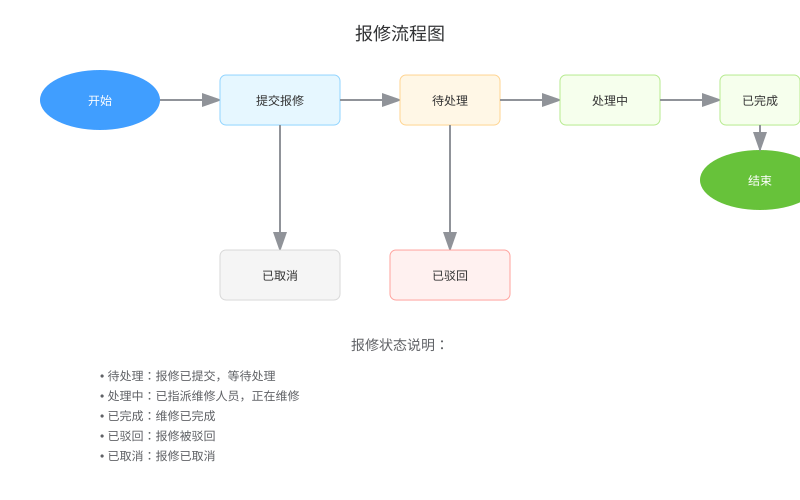

### 5.10 使用说明书管理

**功能说明：** 管理设备使用说明书等技术文档，支持文档的上传、下载、版本管理，可关联到仓库或物资。

**操作步骤：**

1. 在左侧菜单中点击"使用说明书管理"，进入使用说明书管理页面。
2. **新增说明书**：点击"新增"按钮，弹出新增对话框。
   - 说明书名称：输入说明书名称（必填）。
   - 关联类型：选择"仓库"或"物资"。
   - 关联对象：根据关联类型选择具体的仓库或物资。
   - 版本号：输入说明书版本号。
   - 上传文件：上传说明书文件（支持PDF、Word等格式，单文件最大10MB）。
   - 点击"确定"保存。
3. **下载说明书**：点击目标说明书所在行的"下载"按钮，下载说明书文件。
4. **修改/删除说明书**：对已上传的说明书进行信息修改或删除操作。

### 5.11 系统监控

#### 5.11.1 操作日志

**功能说明：** 记录系统用户的所有操作行为，支持按操作模块、操作人员、操作时间等条件查询。

**操作步骤：**

1. 在左侧菜单中点击"系统监控" -> "操作日志"，进入操作日志页面。
2. 支持按操作模块、操作状态、操作人员、操作时间等条件筛选查询。
3. 支持查看操作详情和导出日志数据。

#### 5.11.2 登录日志

**功能说明：** 记录系统用户的登录行为，包括登录成功和登录失败的记录。

**操作步骤：**

1. 在左侧菜单中点击"系统监控" -> "登录日志"，进入登录日志页面。
2. 支持按登录地址、用户名称、登录状态等条件筛选查询。

#### 5.11.3 在线用户

**功能说明：** 监控当前系统中的活跃用户状态。

**操作步骤：**

1. 在左侧菜单中点击"系统监控" -> "在线用户"，进入在线用户页面。
2. 页面展示当前在线用户的会话信息，支持强制下线操作。

#### 5.11.4 定时任务

**功能说明：** 管理系统的定时调度任务，支持在线添加、修改、删除任务，查看执行结果日志。

**操作步骤：**

1. 在左侧菜单中点击"系统监控" -> "定时任务"，进入定时任务管理页面。
2. **新增任务**：点击"新增"按钮，填写任务名称、调用目标、Cron表达式等信息，点击"确定"保存。
3. 支持立即执行一次、修改、删除、查看日志等操作。

#### 5.11.5 服务监控

**功能说明：** 监视当前系统的CPU、内存、磁盘、JVM堆栈等服务器资源使用情况。

**操作步骤：**

1. 在左侧菜单中点击"系统监控" -> "服务监控"，进入服务监控页面。
2. 页面实时展示服务器的CPU使用率、内存使用率、磁盘使用情况、JVM内存信息等。

#### 5.11.6 缓存监控

**功能说明：** 查看系统的Redis缓存信息，包括缓存命令统计、内存使用、Key数量等。

**操作步骤：**

1. 在左侧菜单中点击"系统监控" -> "缓存监控"，进入缓存监控页面。
2. 支持查看缓存基本信息、命令统计、内存信息，以及在线清理缓存操作。

#### 5.11.7 数据监控

**功能说明：** 监视当前系统数据库连接池状态，可进行SQL分析找出系统性能瓶颈。

**操作步骤：**

1. 在左侧菜单中点击"系统监控" -> "数据监控"，进入数据监控页面（Druid监控控制台）。
2. 可查看SQL执行统计、Web请求统计、URI监控等信息。

### 5.12 系统工具

#### 5.12.1 代码生成

**功能说明：** 根据数据库表结构一键生成前后端CRUD代码（Java、HTML、XML、SQL），支持自定义模板配置。

**操作步骤：**

1. 在左侧菜单中点击"系统工具" -> "代码生成"，进入代码生成页面。
2. 选择数据库表，点击"生成代码"按钮，系统自动生成对应的Controller、Service、Mapper、Entity、Vue页面等代码文件。
3. 支持自定义生成配置，包括包名、模块名、作者等。

#### 5.12.2 系统接口

**功能说明：** 根据业务代码自动生成API接口文档（基于Swagger），方便前后端联调。

**操作步骤：**

1. 在左侧菜单中点击"系统工具" -> "系统接口"，进入接口文档页面。
2. 页面展示所有API接口的详细信息，包括请求方式、请求路径、请求参数、响应结果等。
3. 支持在线调试接口功能。

### 5.13 微信小程序端

#### 5.13.1 小程序登录

**操作说明：**

用户通过微信扫码或搜索小程序名称进入系统。

**操作步骤：**

1. 打开微信，扫描小程序二维码或在微信中搜索小程序名称。
2. 进入小程序登录页面。
3. 输入用户名和密码进行登录。
4. 登录成功后进入小程序首页。

**界面示意：**


#### 5.13.2 首页功能

**操作说明：**

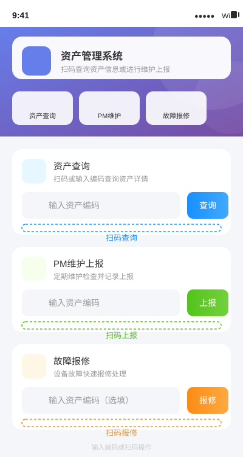

小程序首页提供常用功能的快捷入口。

**功能说明：**

- 显示资产概览信息。
- 提供扫码查看资产详情功能。
- 提供巡检报告、报修申请等功能入口。
- 显示待处理事项提醒。

#### 5.13.3 资产详情查看

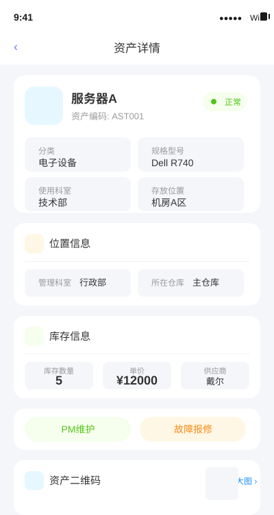

**操作说明：**

用户可通过扫码或搜索方式查看资产详细信息。

**操作步骤：**

1. 在首页点击"扫码"按钮，扫描设备上的资产二维码。
2. 系统自动识别资产编码，显示资产详细信息。
3. 详情页展示物资编码、名称、分类、规格型号、使用科室、存放位置、库存数量等信息。

#### 5.13.4 巡检报告

**操作说明：**

巡检人员通过小程序提交巡检报告。

**操作步骤：**

1. 在小程序首页点击"巡检报告"功能入口。
2. 选择或扫码识别巡检设备。
3. 填写巡检人、巡检结果等信息。
4. 对各个检查项逐一填写检查结果。
5. 拍照上传巡检现场照片。
6. 点击"提交"完成巡检报告。

#### 5.13.5 报修申请

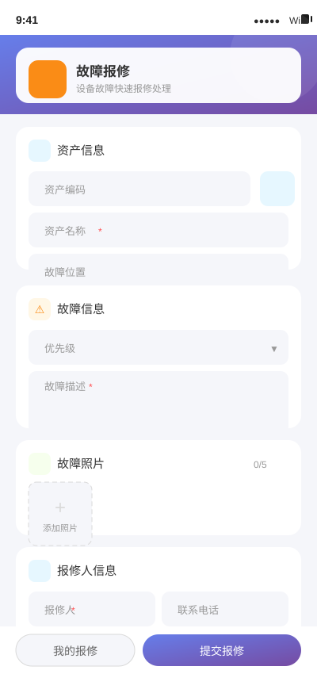

**操作说明：**

用户通过小程序提交设备报修申请。

**操作步骤：**

1. 在小程序首页点击"报修申请"功能入口。
2. 扫描或手动输入故障设备的资产编码。
3. 填写故障描述、故障位置等信息。
4. 拍照上传故障现场照片。
5. 选择优先级。
6. 点击"提交"完成报修申请。

#### 5.13.6 报修处理

**操作说明：**

维修人员通过小程序处理报修工单。

**操作步骤：**

1. 在小程序首页点击"报修处理"功能入口。
2. 查看待处理的报修列表。
3. 选择目标报修记录，查看故障详情。
4. 填写处理结果和维修情况。
5. 点击"确认完成"提交处理结果。

#### 5.13.7 个人中心

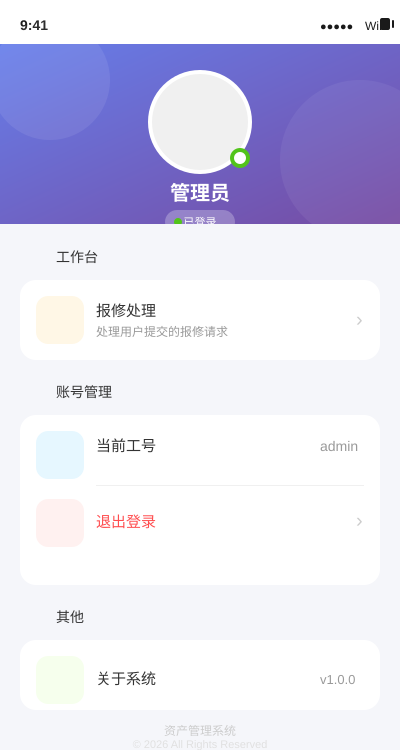

**操作说明：**

用户在个人中心查看和管理个人信息。

**功能说明：**

- 查看当前登录用户信息。
- 修改个人密码。
- 查看个人操作记录。
- 退出登录。

---

## 6 异常处理与常见问题

### 6.1 登录异常

| 异常现象 | 可能原因 | 解决方法 |
|:---|:---|:---|
| 提示"用户名或密码错误" | 输入的用户名或密码不正确 | 检查用户名和密码是否正确，注意大小写 |
| 提示"验证码错误" | 验证码输入错误 | 重新输入验证码，注意数学计算结果 |
| 提示"用户已被锁定" | 连续5次输入错误密码 | 等待10分钟后重试，或联系管理员解锁 |
| 登录页面无法访问 | 服务未启动或网络异常 | 检查服务是否正常运行，检查网络连接 |

### 6.2 数据操作异常

| 异常现象 | 可能原因 | 解决方法 |
|:---|:---|:---|
| 新增/修改数据失败 | 必填项未填写或格式不正确 | 检查表单中带*号的必填项是否已填写，数据格式是否正确 |
| 删除数据失败 | 该数据被其他模块引用 | 先删除关联数据后再删除目标数据 |
| 查询结果为空 | 查询条件过于严格或数据不存在 | 放宽查询条件或确认数据是否存在 |
| 导出Excel失败 | 数据量过大或服务器异常 | 减少导出数据量，或稍后重试 |

### 6.3 网络异常

| 异常现象 | 可能原因 | 解决方法 |
|:---|:---|:---|
| 页面加载缓慢 | 网络延迟或服务器负载高 | 检查网络状况，或联系管理员检查服务器状态 |
| 接口请求超时 | 服务器响应超时 | 检查后端服务是否正常，检查数据库连接是否正常 |
| 页面显示"网络错误" | 网络连接中断 | 检查网络连接，刷新页面重试 |

### 6.4 文件上传异常

| 异常现象 | 可能原因 | 解决方法 |
|:---|:---|:---|
| 文件上传失败 | 文件大小超过限制 | 单个文件最大支持10MB，请压缩后重新上传 |
| 图片上传失败 | 图片格式不支持 | 上传JPG、PNG、GIF等常见图片格式 |
| 说明书上传失败 | 文件格式不支持 | 上传PDF、Word等支持的文档格式 |

---

## 7 附录

### 7.1 数据字典说明

**报修优先级：**

| 字典值 | 显示标签 | 说明 |
|:---|:---|:---|
| low | 低 | 非紧急情况，可安排常规维修 |
| normal | 普通 | 一般故障，按正常流程处理 |
| high | 高 | 较为紧急，需优先处理 |
| urgent | 紧急 | 紧急故障，需立即处理 |

**报修状态：**

| 字典值 | 显示标签 | 说明 |
|:---|:---|:---|
| pending | 待处理 | 报修已提交，等待处理 |
| processing | 处理中 | 已指派维修人员，正在维修 |
| completed | 已完成 | 维修已完成 |
| rejected | 已驳回 | 报修被驳回 |
| cancelled | 已取消 | 报修已取消 |

**流转类型：**

| 字典值 | 显示标签 | 说明 |
|:---|:---|:---|
| IN | 入库 | 物资入库存放 |
| OUT | 出库 | 物资出库使用 |
| DAMAGE | 报损 | 物资损坏报告 |
| SCRAP | 报废 | 物资报废处理 |

**变更类型：**

| 字典值 | 显示标签 | 说明 |
|:---|:---|:---|
| location | 位置变更 | 物资存放位置发生变更 |
| department | 科室变更 | 物资所属科室发生变更 |
| status | 状态变更 | 物资状态发生变更 |
| other | 其他 | 其他类型的变更 |

**巡检周期：**

| 字典值 | 显示标签 | 说明 |
|:---|:---|:---|
| daily | 每日 | 每日巡检 |
| weekly | 每周 | 每周巡检 |
| monthly | 每月 | 每月巡检 |
| quarterly | 每季度 | 每季度巡检 |
| yearly | 每年 | 每年巡检 |

**巡检结果：**

| 字典值 | 显示标签 | 说明 |
|:---|:---|:---|
| normal | 正常 | 设备运行正常 |
| abnormal | 异常 | 设备存在异常，需进一步处理 |

**通用状态：**

| 字典值 | 显示标签 | 说明 |
|:---|:---|:---|
| 0 | 正常 | 数据正常可用 |
| 1 | 停用 | 数据已停用 |

### 7.2 系统权限说明

系统采用基于RBAC（Role-Based Access Control）的权限控制模型，权限粒度分为以下层级：

**菜单权限：** 控制用户可访问的菜单和页面。

**按钮权限：** 控制页面中各操作按钮（新增、修改、删除、导出等）的可见性。

**数据权限：** 控制用户可查看的数据范围。

| 数据权限范围 | 说明 |
|:---|:---|
| 全部数据权限 | 可查看系统所有数据 |
| 自定义数据权限 | 可查看指定部门的数据 |
| 本部门数据权限 | 仅可查看本部门数据 |
| 本部门及以下数据权限 | 可查看本部门及下级部门数据 |
| 仅本人数据权限 | 仅可查看本人创建的数据 |

### 7.3 快捷操作说明

| 操作 | 说明 |
|:---|:---|
| 刷新页面 | 点击标签页上的刷新按钮 |
| 全屏显示 | 点击顶部导航栏的全屏按钮 |
| 关闭标签页 | 点击标签页上的关闭按钮 |
| 关闭其他标签页 | 右键点击标签页，选择"关闭其他" |
| 关闭所有标签页 | 右键点击标签页，选择"关闭所有" |
| 修改密码 | 点击右上角头像 -> 个人中心 -> 修改密码 |
| 清空查询条件 | 点击查询区域的"重置"按钮 |

---

**文档编写完成**

本手册详细介绍了"企业资产与物资管理系统V1.0"的安装部署、功能操作、异常处理等内容。如有疑问，请联系系统管理员。
